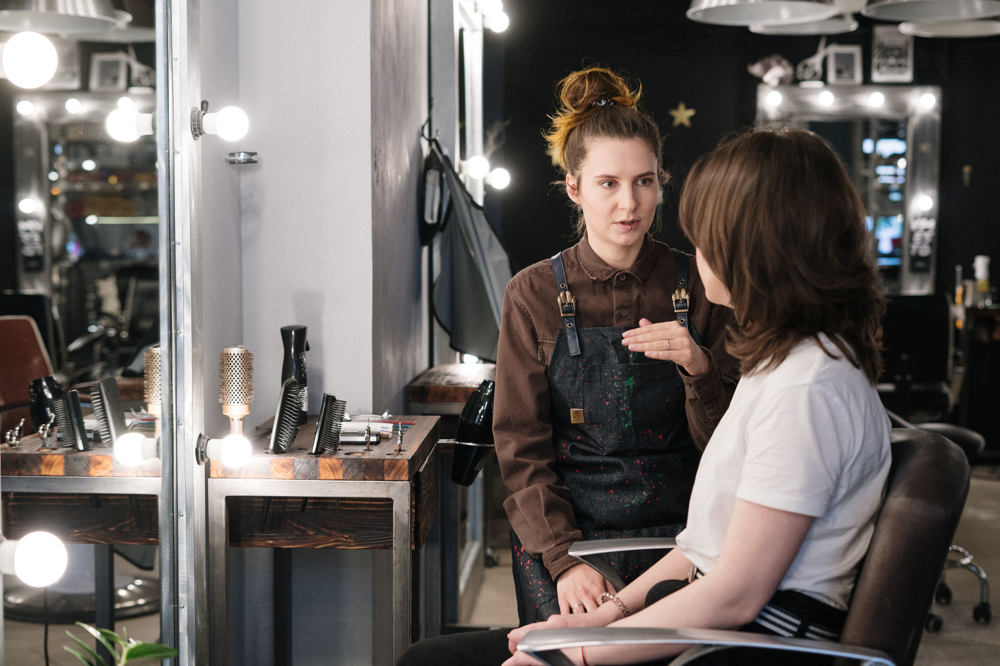
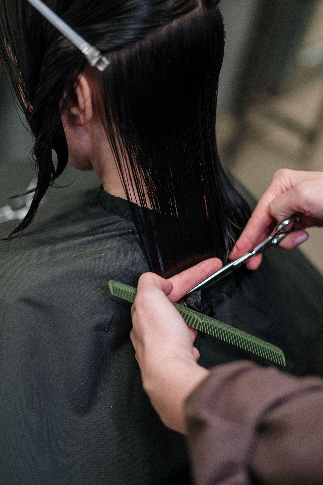
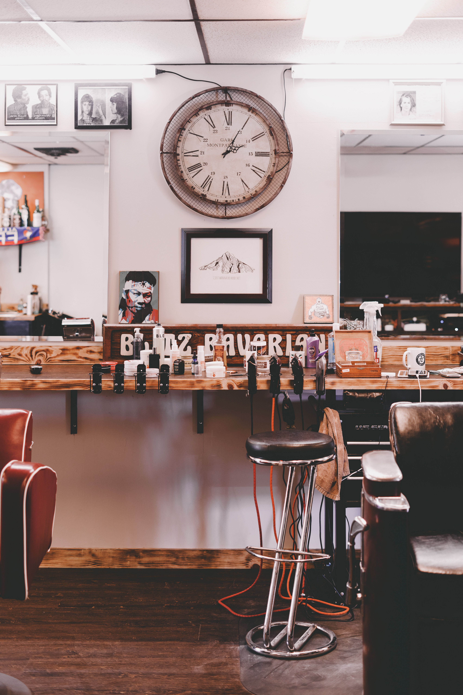
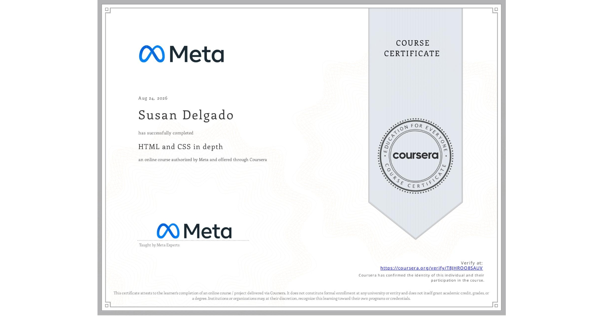

<p align="center">
  
</p>

# HairDayCapstone

The project was developed as a front-end capstone for a <a href="https://coursera.org/share/cbd596fabb4d48b6d0610160b56826f5" alt="meta cert" target="_blank">Certified Meta</a> course I took semantic HTML and custom CSS to refresh my knowledge.

A responsive one-page website concept for **Hair Day**, a boutique salon in Madison, Wisconsin specializing in custom color, modern cuts, styling, makeup, and nail services.


<p align="center">
  
</p>

## Project Goals

The site is designed to communicate a warm, modern, boutique salon identity while emphasizing Hair Day's more distinctive services:

- Custom and expressive hair color
- Modern cuts and styling
- Makeup services
- Nail services
- Beauty tutorials
- Appointment booking

The design also creates urgency around limited custom-color appointment availability.

## Features

- Responsive page structure
- Semantic HTML5
- Custom CSS styling
- Accessible navigation labels
- Service cards
- Booking calls to action
- Salon branding and logo treatment
- Responsive imagery
- Mobile-friendly layout

## Service Presentation

<table>
  <tr>
    <td width="33%" valign="top">
      
      <br><strong>Custom Color</strong>
    </td>
    <td width="33%" valign="top">
      
      <br><strong>Cut & Style</strong>
    </td>
    <td width="33%" valign="top">
      
      <br><strong>Makeup & Nails</strong>
    </td>
  </tr>
</table>

## Technology

- HTML5
- CSS3
- Responsive web design
- CSS Grid / Flexbox
- Semantic markup
- Accessible image and navigation markup

## Repository Structure

```text
HairDayCapstone/
|-- index.html
|
|-- css/
|   `-- styles.css
|
`-- img/
    |-- hairday.png
    |-- hairday1.png
    |-- logo.png
    |-- logo2.png
    |-- hero.jpg
    |-- color-service.jpg
    |-- cut-style.jpg
    `-- beauty-bar.jpg
```

## Running Locally

Clone the repository:

```bash
git clone https://github.com/susanndelgado/HairDayCapstone.git
cd HairDayCapstone
```

Open `index.html` directly in a browser, or serve the project locally:

```bash
python3 -m http.server 8000
```

Then visit:

```text
http://localhost:8000
```

## Project Status

Portfolio / capstone project.

The current implementation is a front-end concept. Booking and tutorial links are presentation elements and would require integration with real services or application logic for production use.


<p align="center">
 <a href="https://coursera.org/share/cbd596fabb4d48b6d0610160b56826f5" alt="meta cert" target="_blank"></a>
</p>
